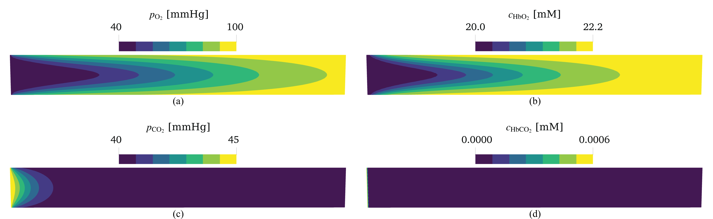
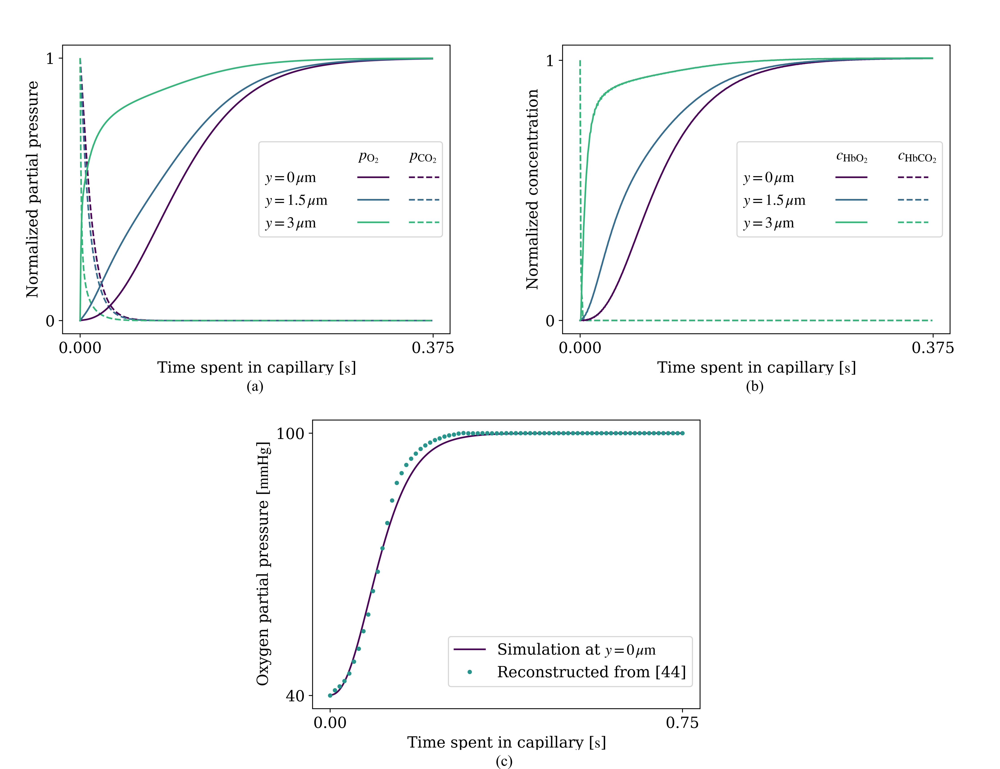
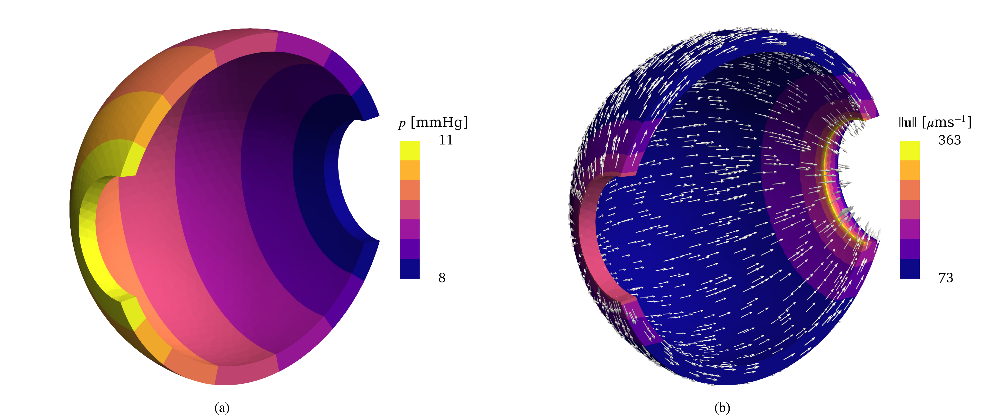
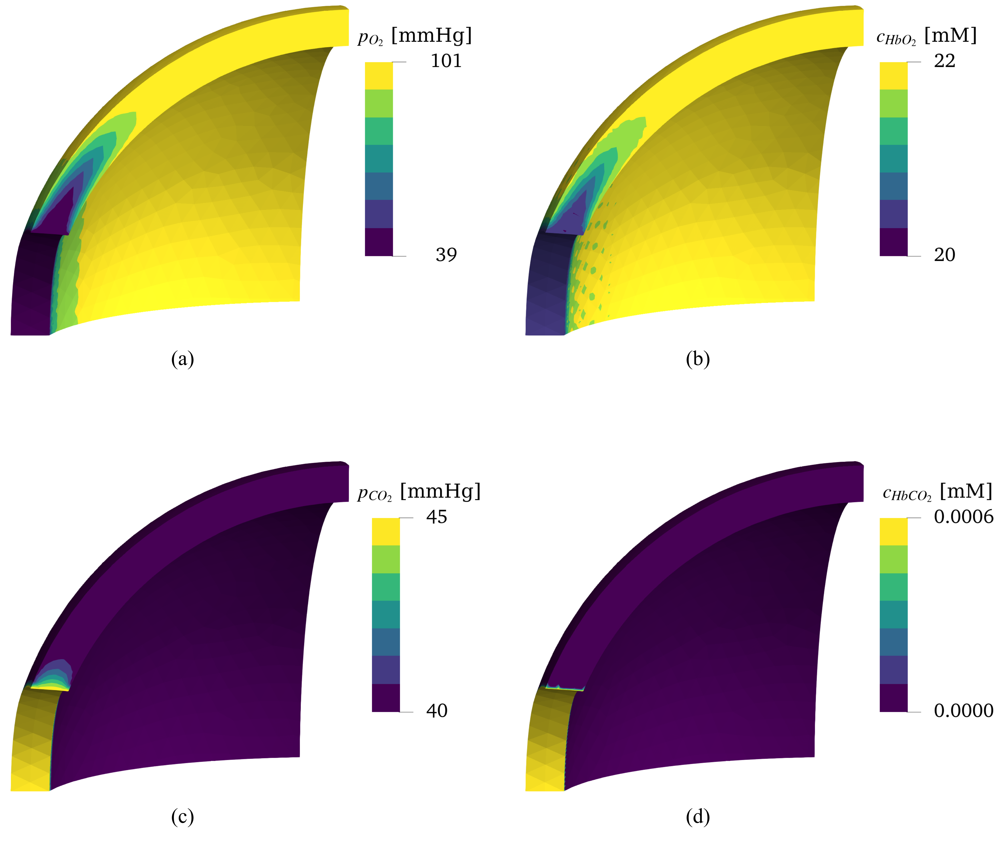
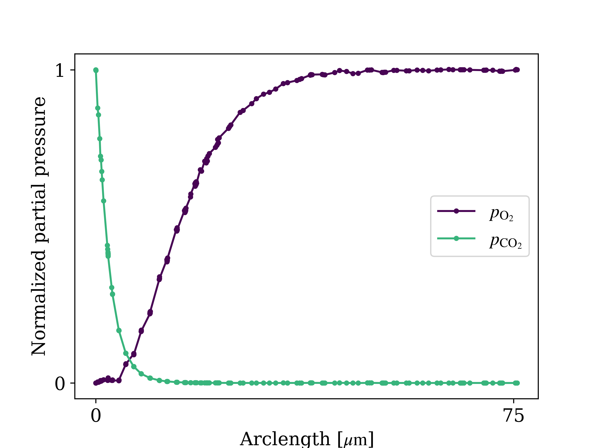
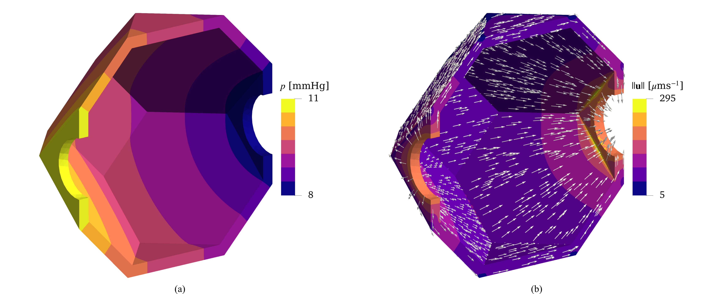
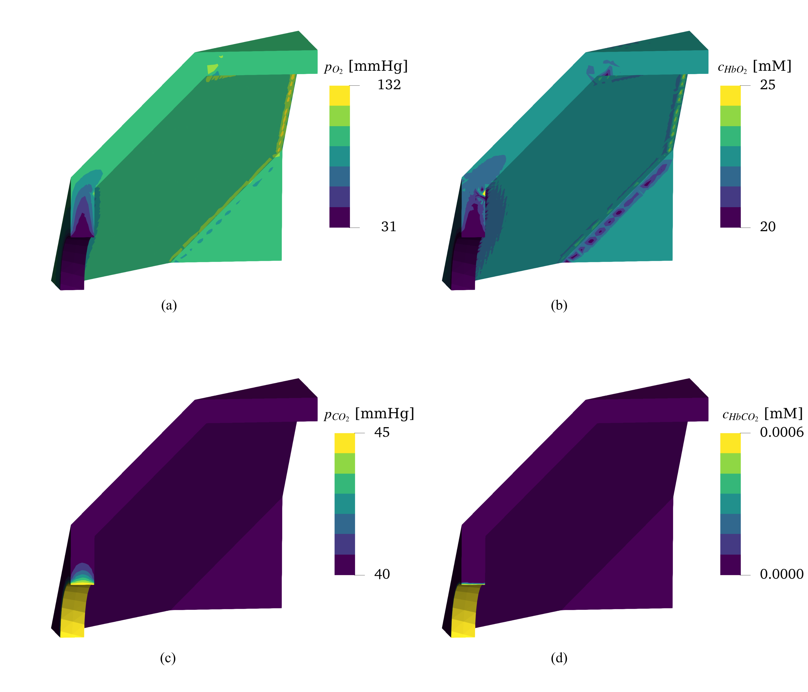

# [Computational modeling of capillary perfusion and gas exchange in alveolar tissue](https://www.sciencedirect.com/science/article/abs/pii/S0045782522004686)

Pablo Zurita Soler (_[@pzuritas](https://github.com/pzuritas)_), Daniel E. Hurtado (_[@dehurtado](https://github.com/dehurtado)_)

Repository housing the codes used for simulations showcased in [Zurita & Hurtado, 2022.](https://www.sciencedirect.com/science/article/pii/S0045782522004686)

## Abstract

Gas exchange is an essential function of the respiratory system that couples fundamentally with perfusion in respiratory alveoli. Current mathematical formulations and computational models of these two phenomena rely on one-dimensional approximations that neglect the intricate volumetric microstructure of alveolar structures. In this work, we introduce a coupled three-dimensional computational model of pulmonary capillary perfusion and gas exchange that conforms to alveolar morphology. To this end, we derive non-linear partial differential equations and boundary conditions from physical principles that govern the behavior of blood and gases in arbitrary alveolar domains. We numerically solve the resulting formulation by proposing and implementing a non-linear finite-element scheme. Further, we carry out several numerical experiments to validate our model against one-dimensional simulations and demonstrate its applicability to morphologically-inspired geometries. Numerical simulations show that our model predicts blood pressure drops and blood velocities expected in the pulmonary capillaries. Moreover, we replicate partial pressure dynamics of oxygen and carbon dioxide reported in previous studies. This overall behavior is also observed in three-dimensional alveolar geometries, providing more detail associated with the spatial distribution of fields of interest and the influence of the shape of the domain. We envision that this model opens the door for enhanced _in silico_ studies of gas exchange and perfusion on realistic geometries, coupled models of respiratory mechanics and gas exchange, and multi-scale analysis of lung function; furthering our understanding of lung physiology and pathology.

## Directories

- `processed-data`: Figures and related results from processed data.
- `raw-data`: Data generated from direct simulations.
- `src`: Source files.
- `tests`: Use examples and tests of the model.

## Results

### Infinite sheet geometry

<figure>

<figcaption align = "center"><b>Transport problem results in two dimensions in a slice of the sheet geometry. (a) Oxygen partial pressure distribution. (b) Oxyhemoglobin concentration distribution. (c) Carbon dioxide partial pressure distribution. (d) Carbaminohemoglobin concentration distribution.</b></figcaption>
</figure>

<figure>

<figcaption align = "center"><b>Gas partial pressures along the capillary. (a) Gas partial pressure distributions at different distances from the blood-air barrier. Oxygen partial pressures, showing a sigmoidal shape in saturation that disappears as one gets closer to the blood-air barrier. Carbon dioxide partial pressures, showing rapid exponential decay at all distances from the blood-air barrier. (b) Hemoglobin compound concentration distributions at different distances from the blood-air barrier. (c) Comparison of simulation results with qualitative results used by the medical community (<a href="https://books.google.cl/books/about/Respiratory_Physiology.html?id=eLRjk-VDF3cC&redir_esc=y">West, 2012</a>) (reference [44] in the <a href="https://www.sciencedirect.com/science/article/pii/S0045782522004686">paper</a>). Simulation results from the sheet flow geometry coincide with the schematics shown commonly in respiratory physiology books.</b></figcaption>
</figure>

### Hollow sphere geometry

<figure>

<figcaption align = "center"><b>Perfusion simulation results on the spherical geometry. (a) Pressure field shown on one half of the spherical domain. (b) Speed field with glyphs highlighting the velocity direction on one half of the spherical domain.</b></figcaption>
</figure>

<figure>

<figcaption align = "center"><b>Transport problem results in the hollow-sphere geometry, shown in an octant highlighting the inlet. (a) Oxygen partial pressure. (b) Oxyhemoglobin concentration. (c) Carbon dioxide partial pressure. (d) Carbaminohemoglobin concentration.</b></figcaption>
</figure>

<figure>

<figcaption align = "center"><b>Normalized gas partial pressure field along an arc approximately on the midsurface of the hollow-sphere domain.</b></figcaption>
</figure>

### Tetrakaidecahedron geometry

<figure>

<figcaption align = "center"><b>Perfusion problem results on the TKD geometry. (a) Pressure field shown on one half of the tetrakaidecahedral domain. (b) Speed field with glyphs highlighting the velocity direction on one half of the domain.</b></figcaption>
</figure>

<figure>

<figcaption align = "center"><b>Transport problem results in a TKD geometry. (a) Oxygen partial pressure. (b) Oxyhemoglobin concentration. (c) Carbon dioxide partial pressure. (d) Carbaminohemoglobin concentration.</b></figcaption>
</figure>

## Dependencies

Coded in Python 3.8.2 64-bit.

- [`FEniCS`](https://fenicsproject.org/) 2019.1.0
- [`numpy`](https://numpy.org/)
- [`pyvista`](https://docs.pyvista.org/) for Jupyter Notebook VTK visualization
- `datetime`
- `os`
- `sys`